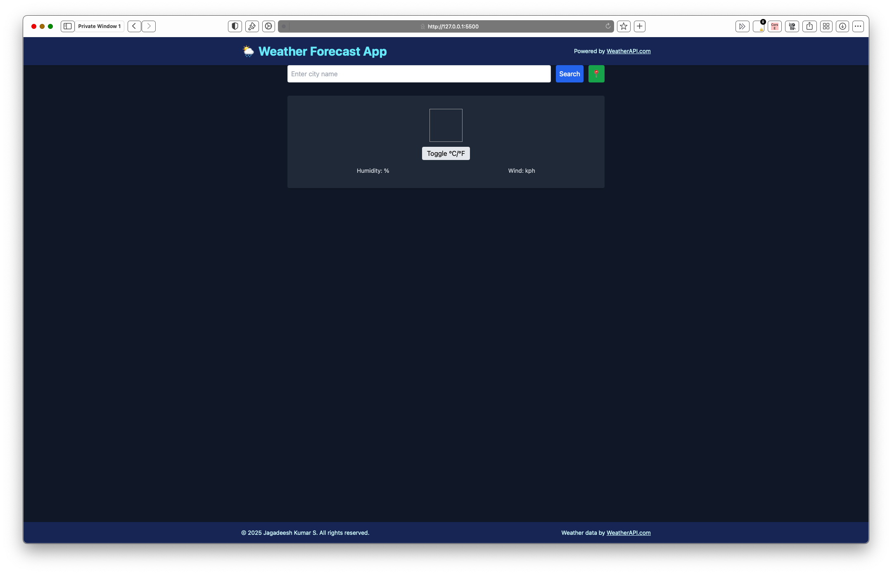

---
# Weather Forecast Application

## Overview

A **responsive weather forecast web app** built with **HTML**, **JavaScript**, **Tailwind CSS**, and a small custom CSS file.
It uses the [WeatherAPI.com](https://www.weatherapi.com/) service to retrieve **real-time weather data** and a **7‑day forecast** for any city.

The app now includes **animated forecast cards** and **popup modals** with detailed weather information when you click on the current weather or any forecast day.
---

## ✨ Features

- **Search weather** by city name or **use current location** (geolocation)
- **Autocomplete city suggestions** with prefix filtering
- **Recent searches** (max 5), stored locally, with the most recent city at the top
- **Current weather details**:
  - Temperature (°C / °F toggle)
  - Humidity %
  - Wind speed (kph)
  - Condition icon
- **7‑day forecast** with:
  - Avg, Max, and Min temperature
  - Wind and humidity
  - Condition icons
- **Extensive UI effects**:
  - Animated fade‑in & slide forecast cards
  - Hover scale & shadow effects
  - Pulsing forecast icons
  - Smooth background changes for rainy conditions
- **Weather Alerts** (≥ 40°C triggers heat warning)
- **Popup modal on click**:
  - Click the **Current Weather** box → Show detailed weather info
  - Click any **Forecast Card** → Show day’s detailed forecast
- **Mobile‑friendly** with Tailwind’s responsive grid

---

## 📂 File Structure

```
weather-app/
├── index.html      # Page layout and structure
├── script.js       # App logic and interactivity
├── style.css       # Custom styling & animations
└── README.md       # Project documentation
```

---

## 🚀 Setup Instructions

1. **Clone this repository**

   ```bash
   git clone https://github.com/YOUR_USERNAME/weather-app.git
   cd weather-app
   ```

2. **Get a WeatherAPI key**

   - Sign up at [WeatherAPI.com](https://www.weatherapi.com/).
   - Copy your API key.
   - Open `script.js` and replace:
     ```javascript
     const apiKey = "YOUR_API_KEY_HERE";
     ```
     with your actual key.

3. **Run locally**
   - Simply open `index.html` in your browser.
   - Or use a local server (for example `Live Server` in VS Code) for better performance.

---

## 📖 Usage

- **Search**: Type a city name and click "Search" or press `Enter`.
- **Autocomplete**: Suggestions will appear after 2+ letters typed; click to select.
- **Current location**: Click 📍 to auto‑detect and load your location's weather.
- **Recent searches**: Choose a city from the dropdown to reload its weather.
- **Toggle °C / °F**: Use the toggle button in the current weather section.
- **Popup modal**:
  - Click the **Current Weather** panel for today's detailed weather.
  - Click any **Forecast Card** for more information about that day's forecast.

---

## 🎨 Visual Effects (VFX)

- **Fade‑in & Slide‑up**: Forecast cards animate in sequence when loaded.
- **Hover Scale & Shadow**: Cards grow slightly and cast a stronger shadow on hover.
- **Pulse Animation**: Icons pulse gently to draw attention.
- **Popup Animation**: Smooth appearing/disappearing modals with details.

---

## 📸 Screenshots

_Add screenshots of your UI here, for example:_

```


```

---

## 📝 Notes

- Weather data by **[WeatherAPI.com](https://www.weatherapi.com/)**
- **Tech Stack**: HTML, JavaScript, TailwindCSS, Custom CSS
- No `npm` or `node_modules` needed — works standalone in a browser

---

## 👨💻 Author

**Jagadeesh Kumar S**

---
