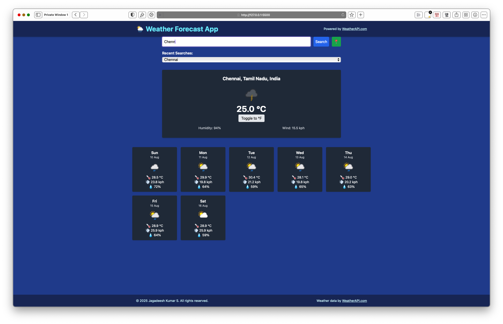

Got it ✅ — your README needs to be fixed so it matches your **current updated code** (which now uses a **7‑day forecast**, not 5), and also removes any leftover placeholder or broken comment text.

Here’s your **cleaned & corrected `README.md`**:

---

# Weather Forecast Application

## Overview

This project is a **Weather Forecast Application** built with **HTML**, **JavaScript**, **Tailwind CSS**, and a small amount of custom CSS for layout.  
It retrieves real-time weather information and a **7‑day forecast** for any city using the [WeatherAPI.com](https://www.weatherapi.com/) service.

The application provides a clean, responsive, and user-friendly interface to check weather conditions by **city name** or **your current location**.  
It also includes an **autocomplete city search**, **recent searches**, **extreme temperature alerts**, and **dynamic background changes** for rainy weather.

---

## Features

- 🔍 **Search by city name** or 📍 **current location** (via browser geolocation).
- ⌨️ **Autocomplete suggestions** while typing (prefix-matching for relevant cities).
- 🕒 **Recently searched cities list** stored locally (max 5 entries).
- 🌡 **Current weather details**:
  - Temperature (°C / °F toggle)
  - Humidity
  - Wind speed
  - Weather condition icon
- 🚨 **Extreme heat alert** when temperature ≥ 40°C.
- 🌧 **Dynamic rainy background** for rainy weather codes.
- 📆 **7‑day forecast** with daily:
  - Average temperature
  - Max wind speed
  - Average humidity
  - Weather icons
- 📱 **Responsive design** for desktop, tablet, and mobile (tested on iPad Mini, iPhone SE).

---

## Setup Instructions

1. **Clone the repository:**

   ```bash
   git clone https://github.com/JKS-sys/weather-api-at-0001.git
   cd weather-api-at-0001
   ```

2. **Get your WeatherAPI key:**

   - Sign up at [WeatherAPI.com](https://www.weatherapi.com/) for a free API key.
   - Open `script.js` and replace:
     ```javascript
     const apiKey = "YOUR_API_KEY_HERE";
     ```
     with **your actual API key**.

3. **Open the app:**
   - Double-click `index.html` (or run it via a local HTTP server if preferred).

---

## Usage

- **Search:** Type a city name and click **Search** or press **Enter**.
- **City suggestions:** While typing, choose from matching city suggestions.
- **Current location:** Click the 📍 button (allow location permission in your browser).
- **Recent searches:** Select a previously searched city from the dropdown to instantly reload weather data.
- **Temperature units:** Click the toggle button to switch between °C and °F.
- **Forecast:** Scroll down to view the full 7‑day forecast with daily weather details.

---

## Notes

- Weather data powered by **[WeatherAPI.com](https://www.weatherapi.com/)**.
- Styling via **Tailwind CSS** (via CDN) plus a small custom `style.css`.
- No `node_modules` or npm installation is required.

---

## File Structure

```
weather-app/
├── index.html      # Main HTML layout
├── script.js       # JavaScript logic (7-day forecast)
├── style.css       # Custom styles (layout, fade-in animation)
├── README.md       # Project documentation
```

---

## Author

**Jagadeesh Kumar S**

---

💡 **Tip:** For better presentation in your submission, add screenshots of search, current weather, and the 7‑day forecast:

```md
## Screenshots



```
